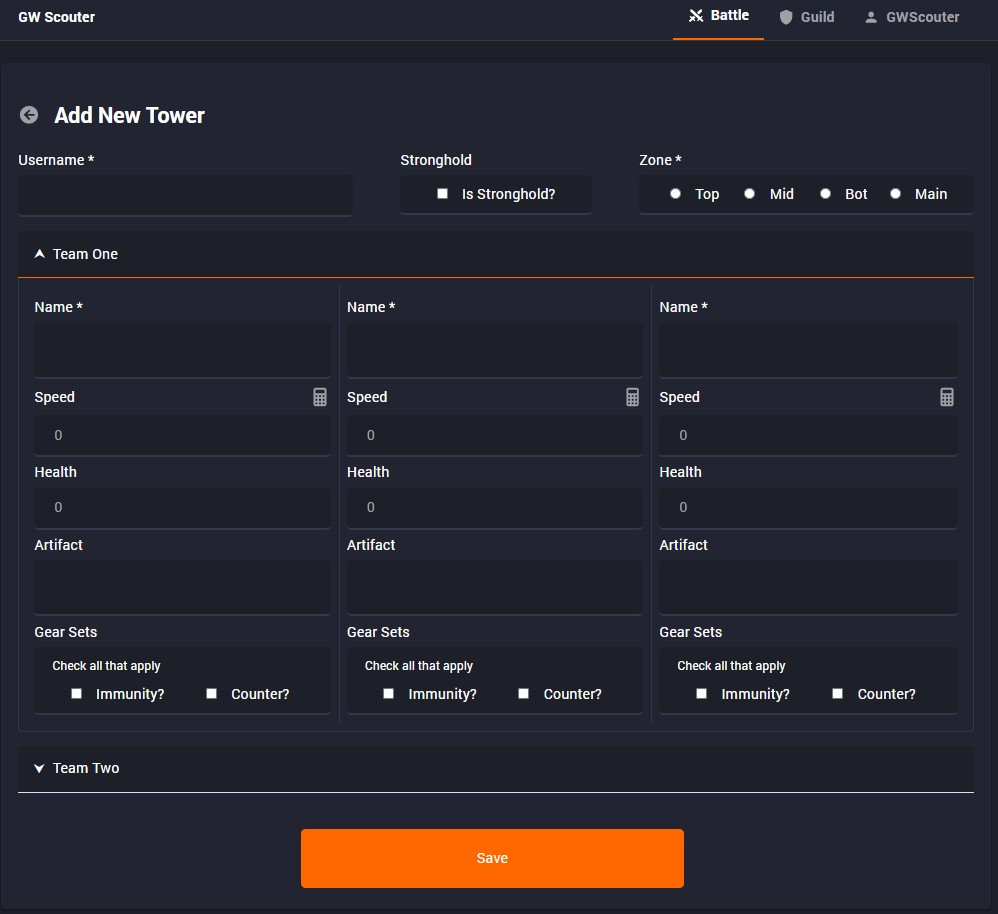

<h1 align="center">GWScouter</h1>

<h1 align="center"><a href="http://murmuring-fjord-28353.herokuapp.com/">Live Project</a></h1>
<h2 align="center"><a href="http://murmuring-fjord-28353.herokuapp.com/TestUser">Dummy Account Auth</a></h2>

# Table of Contents
- [Description](#description)
- [Game Context](#game-context)
  * [Combat](#combat)
  * [Units](#units)
  * [Guild Wars Information](#guild-wars-information)
- [GWScouter Features](#gwscouter-features)
  * [Battle](#battle)
    + [Tower](#tower)
      - [Add New Tower](#add-new-tower)
      - [Edit Unit](#edit-unit)
  * [Guild](#guild)
    + [In a Guild](#in-a-guild)
      - [Invite](#invite)
      - [Members Table](#members-table)
    + [Not in a Guild](#not-in-a-guild)
  * [User](#user)

# Description

A web app designed to help Epic Seven users collaborate by scouting enemy unit information in Guild War battles. GWScouter includes tower and unit creation and modification, guild management, and user customization. Desktop and mobile friendly.

# Game Context
## Combat

Epic Seven features various PvP combat systems that are all turn-based. Preparation plays a big part in winning these PvP matches. For example, you can adjust your strategy if you know that the enemy units will take the first turn over your own units.

## Units

The most important unit stats to keep track of are as follows
1. Artifact 
    * An additional "equipment piece" that grants the unit bonus effects.
2. Speed
    * Determines the turn order of each unit. E.g the unit with the highest speed takes the first turn.
3. Health
4. Gear Sets
    * Equipping certain amounts of the same equipment sets grants additional effects. E.g immunity set will make the unit "immune" from debuffs for until they complete their first turn.
## Guild Wars Information
* Guild wars is a PvP mode where each guild member assigns <b>two</b> teams of <b>three</b> units to defend their own <b>fort</b> and attack opposing enemy guild forts.
    * 
* There are four different "zones" where forts can be assigned. Top, middle, bottom, and one main stronghold.
    * 
    * 
    
* Guild wars only occur three times a week. Monday, Wednesday, and Friday at 10AM UTC and they run for 24 hours.

# GWScouter Features
* Because GWScouter's main goal is to share information with other members a majority of the app's functionality requires authentication as well as being in a "guild". 
    * A link to a dummy account in a dummy guild has been provided at the top of this readme.
## Battle

* On the battle overview a user can easily view, search, and edit all scouted enemy units.
* The battle overview page displays a timer to remind the user of the active Guild War periods as mentioned [above](#guild-wars-information). 
    * The app automatically resets and creates a new battle instance for all available guilds when a new battle period begins.
* The user can navigate through the different "zones" (Top, Mid, Bot and Main) that mirror the game's formations as mentioned [above](#guild-wars-information).
### Tower
#### Add New Tower

* The only required fields are all names as well as indicating which zone an enemy tower belongs in.
* GWScouter helps users by autosuggesting the unit names as well as artifact names.

#### Edit Unit

* All guild members can update existing units with new information.

## Guild
### In a Guild

#### Invite
* Each guild has a unique code and link that allows an authenticated user to join the guild.
* This code can be refreshed by a **Guild Admin**.
#### Members Table
* For non-admin guild members the table only lists all the users in the guild.
* Admin guild members are able to promote/demote other guild members to admin as well as remove them from the guild.
### Not in a Guild

* User is able to create their own guild if they are not in one already.

## User

* GWScouter requires authentication through Discord's OAuth2 service.
* The user can choose to leave their current guild, edit their username, or logout of the current account.